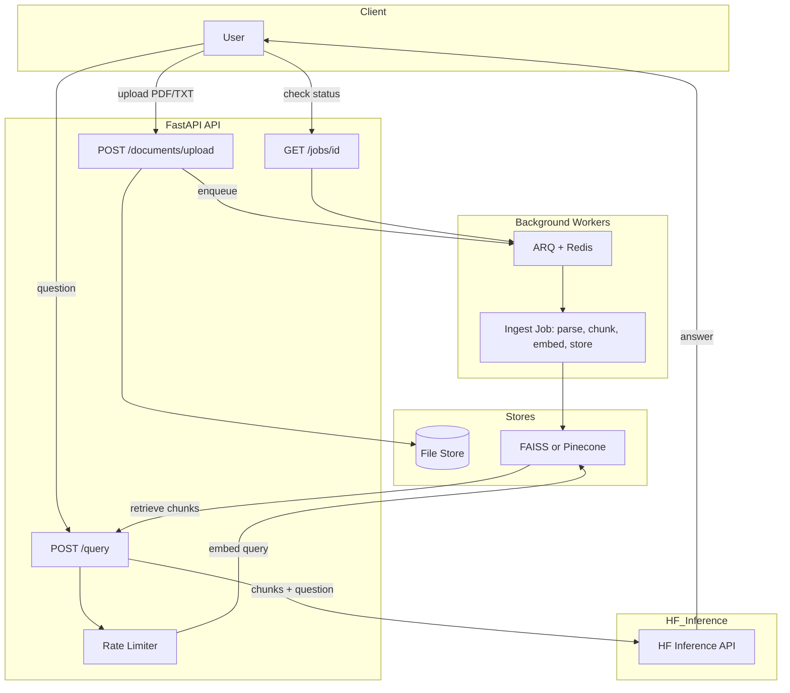

# Architecture

High-level flow: **upload → enqueue ingest → parse/chunk/embed → store (FAISS or Pinecone)**; **query → rate limit → embed → retrieve → HF Inference → answer**.

## Diagram (Mermaid)

Use this diagram in docs, or recreate it in [draw.io](https://app.diagrams.net/) to produce `architecture.drawio`.

## Components

- **API:** FastAPI; `/documents/upload`, `/documents/jobs/{id}`, `/query`, `/health`; slowapi rate limiting.
- **Worker:** ARQ + Redis; ingest task parses PDF/TXT, chunks, embeds via HF API, stores in FAISS or Pinecone.
- **Stores:** File store (uploads), vector store (FAISS or Pinecone).
- **Inference:** Hugging Face Inference API for embeddings and text-generation only; no local models.
